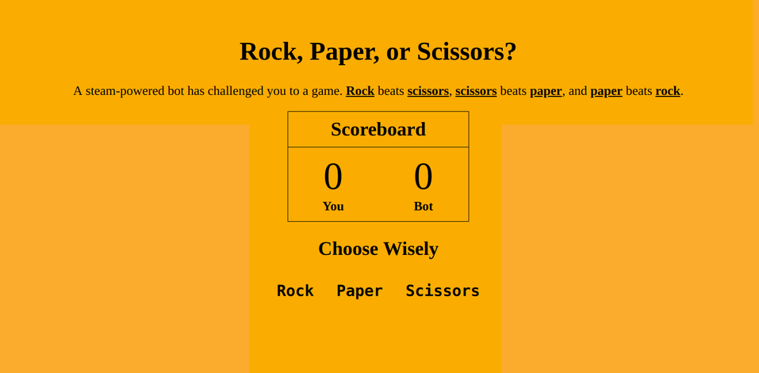

---
# You don't need to edit this file, it's empty on purpose.
# Edit theme's home layout instead if you wanna make some changes
# See: https://jekyllrb.com/docs/themes/#overriding-theme-defaults
layout: default
---

<html lang="en">
<head>
  <meta charset="utf-8">
  <title>Ayo Skip's Profile</title>
  <meta name="viewport" content="width=device-width, initial-scale=1.0">
  <link rel="stylesheet" href="style.css">
  <link href="https://fonts.googleapis.com/css?family=Muli%7CRoboto:400,300,500,700,900" rel="stylesheet">
</head>
  <header>
    
    
My home is Columbia, Maryland.

    

        <ul class="nav">
          <li class="name">AYO Skip</li>
          <li><a href="#">Home</a></li>
          <li><a href="resume.html" target="_blank">Experience</a></li>
          <li><a href="#">Photos</a></li>
          <li><a href="#">Contact</a></li>
        </ul>
    

  </header>

  <body>
    <main class="flex">
      

        <h2 class="card-title">Background</h2>
        

        <ul>
          <li>I’m an aspiring web developer who loves everything about the web. I've lived in lots of different places and have worked in lots of different jobs.</li>
            <li>I’m excited to bring my life experience to the process of building fantastic looking websites.</li>
            <li>I’ve been a professional pizzaiolo and small business owner and am a life-long learner who's always interested in expanding my skills.</li>
          <!-- <li>To learn more,<a href="resume.html">view my resume.</a></li> -->
        </ul>
      

        
    

        <h2 class="card-title">Goals</h2>
        
 I want to master the process of building web sites and increase my knowledge, skills and abilities in:

        <ul class="skills">
          <li>HTML</li>
          <li>CSS</li>
          <li>JavaScript</li>
          <li>Mobile Development</li>
          <li>Full Stack Apps</li>
        </ul>
        
I’d like to work for a web design firm helping clients create an impressive online presence.

      

      
      <a href="https://ayoskip.github.io/Rocks.Papers.Scissors/">Link to Rock Paper Scissors</a>

    </main>
    <footer>
      <ul>
        <li><a href="https://twitter.com/ayo_skip" target="_blank" class="social twitter">Twitter</a></li>
        <li><a href="https://www.linkedin.com/in/sms30/" target="_blank" class="social linkedin">LinkedIn</a></li>
        <li><a href="https://github.com/ayoskip" target="_blank" class="social github">Github</a></li>
      </ul>
      
Copyright 2018, Stephon Skipper

    </footer>
  </body>
</html>
